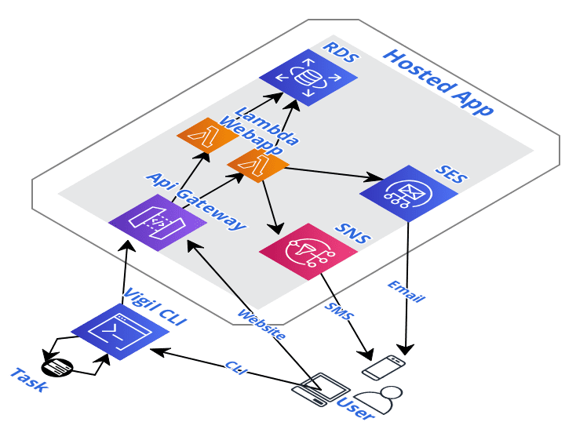
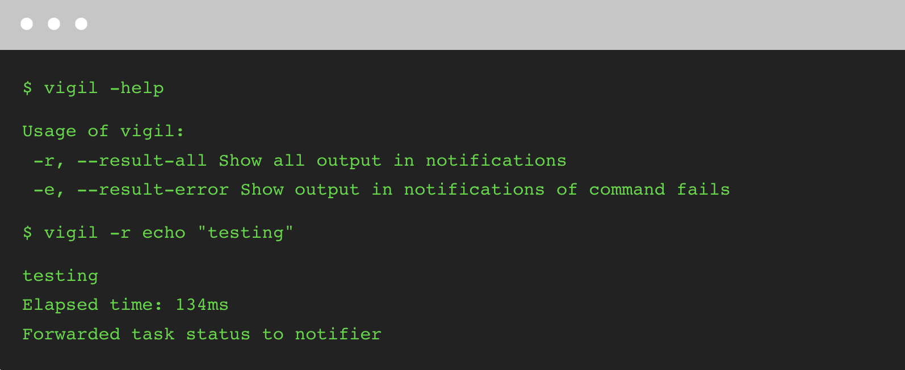

# Overview



If you do a lot of DevOps deployments - let's say with terraform for example - or train machine learning models, one slightly minor hit on productivity is that they can take a while to run and you're not sure when they're done. While not knowing exactly when a task is done is pretty minor, it can add up over time and account for a good chunk of time.

For example, you run a terraform deployment that includes creating some RDS instances, which might take up to ten minutes. In the meantime you go to code review pull requests, and next thing you know, it's been 15 minutes, 5 past when your terraform script finished. Of course that's not always a bad thing, but often times when running tasks via the CLI or prototyping, you have serial dependencies, and the faster you can kick off the next step, the faster you can switch back to more code review, and not introduce unnecessary delays to your manual pipeline.

This is where Vigil comes in. It is a simple service intended to speed up your "manual pipelines" or iterative development by letting you know when a script/CLI task has finished. Check out the application architecture in the above diagram. The app is powered by serverless which lets us run on-demand at low cost and scale up when needed. The other services used are postgres via RDS, SES for email notifications, and SNS for SMS notifications.

Note again this is more for "manual pipelines" or iterative development, running tasks from the shell. For automated pipelines in CI/CD tools or taskflow tools like Airflow/Luigi, there is usually a notification hook built-in or via an extension.



And this brings up another good point; in these automated pipelines, we're typically only interested in a notification when a task fails. Another benefit of using Vigil for wrapping tasks, compared to running tasks naked, is that if we move to some other work while the task runs, and the task unexpectely fails early, we may not check back until a while later (our expected successful runtime) and we lose a lot of time. The notifications also tell you the status of the task (whether it failed/succeeded).

## Running

```
./run.sh
```

## Deploying

```
make deploy-api
make deploy-web
```

## Development

- [ ] implement timer type / interface
- [x] create gui with login, notification type config and token
- [ ] rotate token button
- [ ] switch out sending token directly to using it to sign the request, like aws
- [ ] mask token and button to display it
- [ ] cli read token for auth
- [ ] endpoint for cli to call to web app
- [ ] gateways for webapp to forward sms /smtp
- [ ] android / iphone app for push notifications only (auth with token)
- [ ] split out notification handler
- [x] login logic
- [ ] add country picker for phone number, take out manipulation on save
- [ ] replace webapp with webapp-new and move it up a level
- [ ] switch out db credentials from db admin to application user
- [ ] authorization
- [ ] automate setting route53 domain to point to api gateway
- [ ] add allow sendEmail, sendSMS to lambda role
- [ ] add binary for download onto the web page. add instructions
